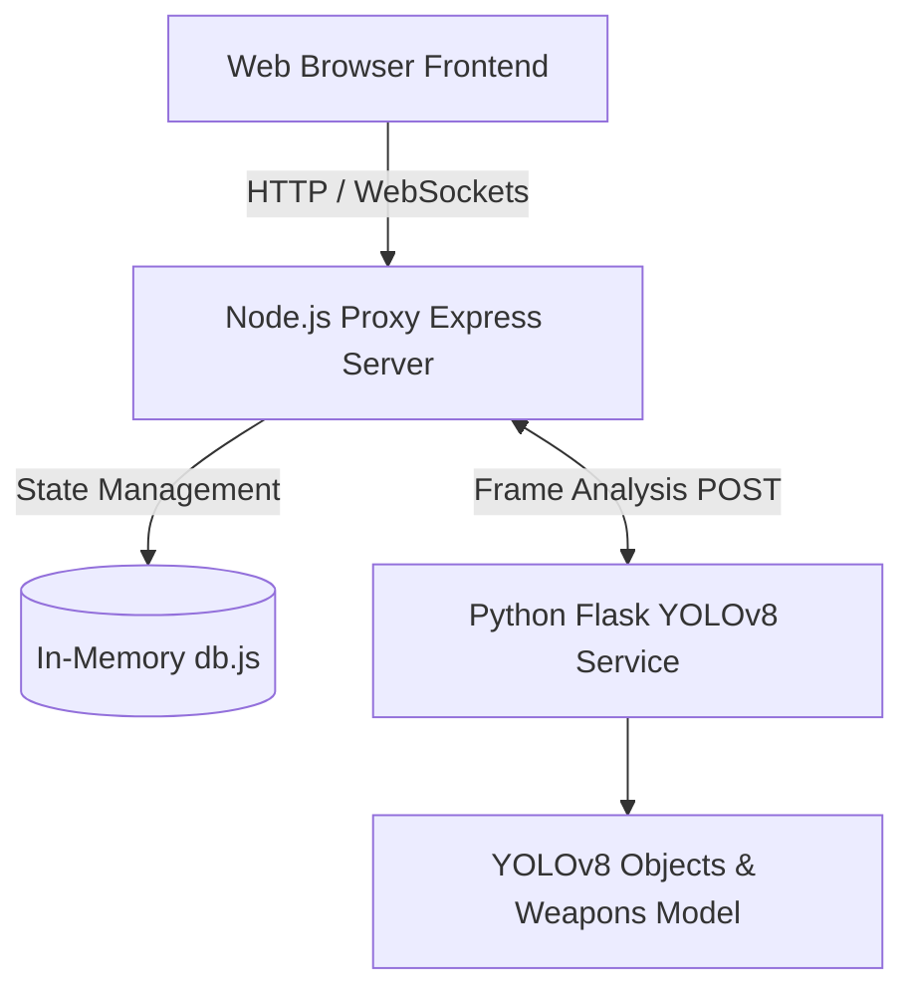

# Architecture

> Generated by /map on 2026-02-23

## Overview
The ATM CCTV Monitoring System (SADRS) is a dual-service architecture. It consists of a primary Node.js monolithic backend that serves the vanilla HTML/JS/CSS frontend dashboard, handles live WebSocket updates, state management, and real-time CCTV monitoring. It proxies heavy machine-learning frame analysis tasks to a supplementary stateless Python microservice.

## System Diagram

## Components

### Node.js Backend Server
- **Purpose:** Manages core API requests, sessions, WebSockets, and hosts the frontend UI. 
- **Location:** `server.js`, `routes/api.js`
- **Dependencies:** `express`, `cors`, `socket.io`, `bcrypt`, `axios`
- **Dependents:** Frontend client

### Python ML Microservice
- **Purpose:** Isolated environment for running ML inference (YOLOv8) on camera frames. Returns threat classifications and detected objects.
- **Location:** `ml_service/app.py`, `ml_service/detector.py`
- **Dependencies:** `flask`, `ultralytics`, `pillow`
- **Dependents:** Node.js Backend Server (`axios` calls to `/analyze`)

### In-Memory Database
- **Purpose:** Simplistic data store for prototype state (ATMs, cameras, logs, threats, user sessions).
- **Location:** `database/db.js`
- **Dependencies:** `bcrypt` (for seeding default admin)
- **Dependents:** Node.js API Routes

### Frontend Client
- **Purpose:** UI Dashboard for CCTV monitoring operators. Uses Vanilla JS and HTML for fast, lightweight rendering.
- **Location:** `public/app.js`, `public/app-enhancements.js`, `public/index.html`
- **Dependencies:** `Chart.js` (CDN), Socket.io client script
- **Dependents:** N/A

## Data Flow
1. User authenticates via the Frontend (`app.js`).
2. Express server verifies credentials against `db.js` and creates an `express-session`.
3. The dashboard connects via `Socket.io` to receive simulated live alert updates every 10 seconds.
4. When a user requests ML frame analysis for a camera on the Live Feed, the Frontend sends an API POST to `NodeServer`.
5. `NodeServer/api.js` proxies this request to the `Python MLService` on port 5001.
6. `MLService` analyzes the payload using YOLOv8, determines the threat level, and responds to `NodeServer`.
7. `NodeServer` determines if the threat is high enough to be logged and stored in `db.js`, then emits a global `threat_detected` WebSocket event.
8. Frontend displays the threat details overlay on the camera card.

## Integration Points
| External Service | Type | Purpose |
|------------------|------|---------|
| ML Flask Service | Internal API | Sub-service for heavy AI interference |
| Chart.js CDN | External Library | Charts for the analytics dashboard |

## Conventions
- **Naming:** CamelCase for frontend logic variables, Snake_case for database entities and Python variables. 
- **Structure:** Hybrid setup. Traditional Express structure (`routes/`, `public/`, `database/`) plus an isolated `ml_service/` folder for Python.
- **Testing:** No automated testing framework detected.

## Technical Debt
- [ ] No persistent database (currently using an in-memory JS array that resets on server restart).
- [ ] Hardcoded secret keys in `server.js` (`atm-cctv-secret-key-change-in-production`).
- [ ] ML Service currently uses a static fallback image (`sample.jpg`) if no actual camera frame is uploaded.
- [ ] No explicit route restrictions (rate limiting, payload validation) ahead of ML proxy.
