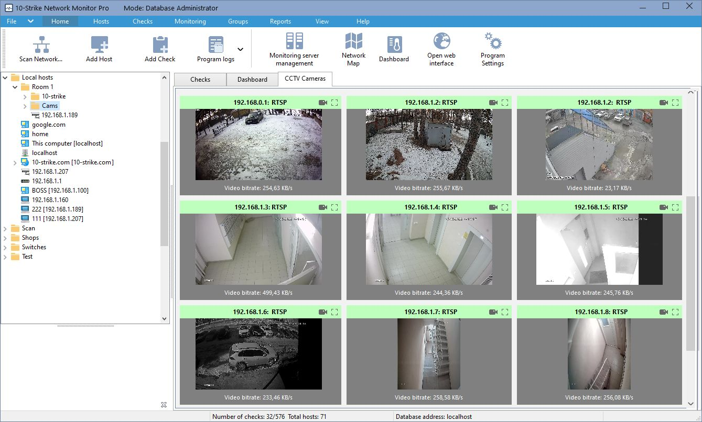

# 🔐 SADRS — Smart ATM Defence & Response System

<div align="center">



**A real-time, AI-powered ATM threat detection and incident response platform.**

[](https://www.python.org/)
[](https://nextjs.org/)
[](https://flask.palletsprojects.com/)
[](https://docs.ultralytics.com/)
[](LICENSE)

</div>

---

## 📖 Overview

SADRS is a full-stack, real-time ATM security monitoring system that combines **computer vision (YOLOv8)**, **sensor fusion**, and **AI-powered incident analysis (Claude API)** to detect, classify, and respond to threats at ATM deployments.

The system follows a distributed edge-cloud architecture:

- **Edge Agent** — Runs on the ATM device; captures webcam footage, runs ML inference, monitors hardware sensors, and streams live video.
- **Backend API** — Flask server that receives incident reports, manages ATM unit state, and pushes real-time events to the dashboard.
- **Frontend Dashboard** — Next.js operator console with live video, incident logs, ATM status map, and AI-generated summaries.
- **Arduino** — Embedded firmware for reading physical sensors (PIR, vibration, temperature, tilt).

---

## 🏗️ Architecture

```
┌─────────────────────────────────────────────────────────┐
│                     EDGE DEVICE (ATM)                   │
│                                                         │
│  ┌──────────────┐   ┌──────────────┐   ┌─────────────┐ │
│  │  CCTVInference│   │ InputMonitor │   │  SensorMon  │ │
│  │  (YOLOv8)    │   │ (Panic PIN)  │   │  (Arduino)  │ │
│  └──────┬───────┘   └──────┬───────┘   └──────┬──────┘ │
│         │                  │                   │        │
│         └──────────────────▼───────────────────┘        │
│                      ┌────────────┐                     │
│                      │ThreatState │                     │
│                      └─────┬──────┘                     │
│                      ┌─────▼──────┐                     │
│                      │MainControl-│ ──► MJPEG Stream    │
│                      │    ler     │     (port 8080)     │
│                      └─────┬──────┘                     │
└────────────────────────────┼────────────────────────────┘
                             │ HTTP + WebSocket
                             ▼
┌─────────────────────────────────────────────────────────┐
│               BACKEND (Flask + SocketIO)                │
│                                                         │
│   /api/v1/heartbeat   /api/v1/incidents                 │
│   /api/v1/atms        /api/v1/evidence/<file>           │
│                                                         │
│   Claude AI Analyst ──► Auto-generated incident summary  │
│   SQLite DB         ──► Persistent incident storage     │
└─────────────────────────────────┬───────────────────────┘
                                  │ WebSocket Events
                                  ▼
┌─────────────────────────────────────────────────────────┐
│           FRONTEND (Next.js 16 + React 19)              │
│                                                         │
│   Live CCTV Feed  │  Incident Log  │  ATM Map (Leaflet) │
│   AI Summaries    │  Operator Actions (Confirm/Dismiss) │
└─────────────────────────────────────────────────────────┘
```

---

## 📁 Project Structure

```
SADRS/
├── 📂 edge/                        # Edge agent (runs on ATM device)
│   ├── main_controller.py          # Entry point — orchestrates all edge services
│   ├── cctv_inference.py           # YOLOv8 CCTV threat detection (dual-thread)
│   ├── threat_state.py             # Shared in-memory threat state machine
│   ├── stream_server.py            # MJPEG HTTP stream server (port 8080)
│   ├── input_monitor.py            # Keyboard/panic PIN hotkey listener (pynput)
│   ├── sensor_monitor.py           # Arduino sensor data polling
│   ├── clip_extractor.py           # Records pre/post-incident video clips
│   ├── gsm_alert.py                # SMS alert integration (GSM module)
│   ├── panic_pin.py                # Panic PIN duress detection logic
│   ├── yolov8n.pt                  # YOLOv8-nano model weights
│   ├── evidence/                   # Saved incident video clips
│   └── requirements.txt
│
├── 📂 backend/                     # Flask API server
│   ├── app.py                      # Flask app factory (SocketIO, CORS, SQLAlchemy)
│   ├── routes.py                   # REST API & SocketIO event routes
│   ├── models.py                   # SQLAlchemy models (AtmUnit, Incident)
│   ├── claude_analyst.py           # Claude AI incident summary generator
│   ├── run.py                      # Server entry point
│   └── requirements.txt
│
├── 📂 frontend/                    # Next.js operator dashboard
│   ├── src/
│   │   ├── app/
│   │   │   ├── page.tsx            # Main dashboard page
│   │   │   ├── layout.tsx          # Root layout
│   │   │   ├── globals.css         # Global styles (Tailwind)
│   │   │   └── api/stream/         # Proxy API for CCTV stream
│   │   └── components/
│   │       └── IncidentDetailModal.tsx  # Incident popup with AI summary
│   ├── package.json
│   └── next.config.ts
│
├── 📂 arduino/                     # Embedded sensor firmware
│   └── sensor_polling/             # Arduino sketch for PIR, vibration, tilt, temp
│
├── DFDDiagram1.png                 # Data Flow Diagram
├── UseCaseDiagram1.png             # Use Case Diagram
├── SADRS_PRD.docx                  # Product Requirements Document
├── SADRS_TRD.docx                  # Technical Requirements Document
├── SADRS_Implementation_Plan.docx  # Implementation Plan
└── cctv_monitoring.jpg             # Fallback image when webcam unavailable
```

---

## ✨ Key Features

| Feature | Description |
|---|---|
| 🔴 **Live CCTV Feed** | Real-time MJPEG stream from webcam with YOLOv8 bounding box overlays |
| 🤖 **AI Threat Detection** | YOLOv8-nano detects weapons, suspicious bags, crowds, and unusual behavior |
| 🧠 **Claude AI Summaries** | Auto-generated natural-language incident reports via Anthropic Claude API |
| 🗺️ **ATM Location Map** | Interactive Leaflet.js map showing real-time ATM status across locations |
| 🚨 **Multi-source Alerting** | Panic PIN + ML vision + hardware sensors (PIR, vibration, tilt, temp) |
| 📹 **Evidence Clips** | Automatic pre/post-incident video clip extraction and storage |
| ⚡ **Real-time Push** | WebSocket (Socket.IO) events push incidents/ATM status to dashboard instantly |
| 🌍 **IP Geolocation** | Edge agent auto-detects and reports its physical location |
| 🔒 **HMAC Auth** | Edge-to-backend requests signed with HMAC-SHA256 for integrity verification |
| 🌙 **Night Mode Detection** | Lowers confidence threshold during late-night hours (23:00–05:00) |

---

## 🚀 Getting Started

### Prerequisites

- Python **3.10+**
- Node.js **18+** and npm
- A webcam (or the system will use a fallback image)
- Anthropic API key (for Claude summaries)

---

### 1️⃣ Clone the Repository

```bash
git clone https://github.com/DevSharma18/SADRS.git
cd SADRS
```

---

### 2️⃣ Backend Setup

```bash
cd backend

# Create and activate virtual environment
python -m venv venv
venv\Scripts\activate        # Windows
# source venv/bin/activate   # macOS/Linux

# Install dependencies
pip install -r requirements.txt

# Create a .env file
echo ANTHROPIC_API_KEY=your_key_here > .env
echo SECRET_KEY=your_flask_secret_key >> .env
echo EDGE_API_SECRET=sadrs-secret-key-12345 >> .env

# Run the backend
python run.py
```

The backend will be available at `http://localhost:5000`.

---

### 3️⃣ Edge Agent Setup

```bash
cd edge

# Create and activate virtual environment
python -m venv venv
venv\Scripts\activate        # Windows

# Install dependencies
pip install -r requirements.txt

# Create a .env file
echo EDGE_API_SECRET=sadrs-secret-key-12345 > .env

# Start the edge agent
python main_controller.py
```

The MJPEG video stream will be served at `http://localhost:8080`.

> **Note:** The YOLOv8 model (`yolov8n.pt`) is included in the `edge/` folder. If it is missing, Ultralytics will automatically download it on first run.

---

### 4️⃣ Frontend Setup

```bash
cd frontend

# Install dependencies
npm install

# Run the development server
npm run dev
```

The dashboard will be available at `http://localhost:3000`.

---

## 🎮 Edge Agent Hotkeys

When the edge agent is running, the following keyboard shortcuts simulate security events:

| Key | Action |
|-----|--------|
| `P` | 🚨 Trigger **Panic PIN** (covert duress alert) |
| `T` | 🔨 Simulate **Tamper / Vibration** event |
| `M` | 👤 Simulate **Motion / PIR** sensor trigger |
| `R` | ✅ **Reset** threat state to ONLINE |

---

## 🔌 API Reference

### `POST /api/v1/heartbeat`
Register or update an ATM unit's online status and location.

```json
{
  "atm_id": "atm-sim-webcam-01",
  "status": "online",
  "latitude": 28.6139,
  "longitude": 77.2090,
  "location_name": "New Delhi, Delhi"
}
```

---

### `POST /api/v1/incidents`
Log a new security incident.

```json
{
  "atm_id": "atm-sim-webcam-01",
  "trigger_type": "ml_cctv",
  "threat_class": "WEAPON_DETECTED",
  "confidence_score": 0.87,
  "sensor_snapshot": {
    "vibration_g": 0.0,
    "pir_triggered": false,
    "temperature_c": 24.5
  }
}
```

---

### `GET /api/v1/incidents`
Retrieve the 50 most recent incidents.

---

### `GET /api/v1/atms`
List all registered ATM units with status and location.

---

### `PATCH /api/v1/incidents/<incident_id>/action`
Update operator action on an incident.

```json
{ "operator_action": "confirmed" }
```
Valid values: `confirmed`, `dismissed`, `escalated`

---

### `GET /api/v1/evidence/<filename>`
Serve a saved evidence video clip.

---

## 🧠 Threat Detection Logic

The ML threat pipeline uses a **3-frame confirmation** strategy to reduce false positives:

1. YOLOv8-nano runs at **~5 FPS** in a background thread, detecting:
   - `person` (class 0) — crowd detection if ≥ 2 persons
   - `backpack` (class 24) → `SUSPICIOUS_BAGGAGE`
   - `baseball bat` (class 34) → `WEAPON_DETECTED`
   - `knife` (class 43) → `WEAPON_DETECTED`
   - `cell phone` (class 67) → `SUSPICIOUS_BEHAVIOR`

2. A threat is confirmed only if it appears in **3 consecutive frames** with confidence ≥ threshold:
   - Normal hours: `0.55`
   - Night mode (23:00–05:00): `0.45`

3. On confirmation, the **Alert Manager** fires and:
   - Saves a 30-second evidence clip (pre/post event)
   - Sends the incident payload to the backend API
   - Broadcasts real-time WebSocket events to the frontend

---

## 🗃️ Data Models

### `AtmUnit`
| Field | Type | Description |
|---|---|---|
| `atm_id` | String (PK) | Unique ATM identifier |
| `location_name` | String | Human-readable location |
| `latitude` / `longitude` | Float | GPS coordinates |
| `status` | String | `online` / `offline` / `incident` |
| `last_heartbeat` | DateTime | Timestamp of last check-in |

### `Incident`
| Field | Type | Description |
|---|---|---|
| `incident_id` | UUID (PK) | Unique incident ID |
| `atm_id` | FK → AtmUnit | ATM that reported the incident |
| `trigger_type` | String | `ml_cctv` / `panic_pin` / `tamper` |
| `threat_class` | String | Detected threat category |
| `confidence_score` | Float | ML model confidence (0–1) |
| `sensor_snapshot` | JSON | Physical sensor readings at time of incident |
| `claude_summary` | Text | AI-generated incident narrative |
| `operator_action` | String | `confirmed` / `dismissed` / `escalated` |
| `created_at` | DateTime | Incident timestamp |

---

## 📡 Real-time Events (WebSocket)

| Event | Direction | Payload |
|---|---|---|
| `new_incident` | Server → Client | Full incident object |
| `incident_updated` | Server → Client | Updated incident (after operator action) |
| `atm_status_update` | Server → Client | Updated ATM unit object |

---

## 🧰 Tech Stack

| Layer | Technology |
|---|---|
| **Frontend** | Next.js 16, React 19, TypeScript, Tailwind CSS, Leaflet.js, Socket.IO client |
| **Backend** | Python, Flask 3, Flask-SocketIO, Flask-SQLAlchemy, Flask-CORS |
| **Edge ML** | Python, OpenCV, Ultralytics YOLOv8-nano, pynput |
| **AI Analysis** | Anthropic Claude API |
| **Database** | SQLite (via SQLAlchemy ORM) |
| **Streaming** | MJPEG over HTTP (custom Flask server, port 8080) |
| **Hardware** | Arduino (PIR, vibration, tilt, temperature sensors) |
| **Auth** | HMAC-SHA256 request signing |

---

## 📄 Documentation

Full project documentation is available in the repository root:

- [`SADRS_PRD.docx`](SADRS_PRD.docx) — Product Requirements Document
- [`SADRS_TRD.docx`](SADRS_TRD.docx) — Technical Requirements Document
- [`SADRS_Implementation_Plan.docx`](SADRS_Implementation_Plan.docx) — Implementation Plan
- [`DFDDiagram1.png`](DFDDiagram1.png) — Data Flow Diagram
- [`UseCaseDiagram1.png`](UseCaseDiagram1.png) — Use Case Diagram

---

## ⚠️ Known Limitations / In Progress

- **Backend is under active development** — some routes and authentication flows are not yet finalized.
- **Arduino firmware** — sensor polling sketch is scaffolded; full integration with the edge agent is pending.
- **GSM alerting** (`gsm_alert.py`) — framework is in place; requires a physical GSM module and SIM card.
- The system currently uses **SQLite** — a production deployment would migrate to PostgreSQL.

---

## 🤝 Contributing

This project is primarily a hackathon prototype. Contributions, bug reports, and suggestions are welcome via [GitHub Issues](https://github.com/DevSharma18/SADRS/issues).

---

## 📜 License

This project is licensed under the **MIT License**. See [LICENSE](LICENSE) for details.

---

<div align="center">
  <sub>Built with ❤️ for smarter, safer ATM infrastructure.</sub>
</div>
